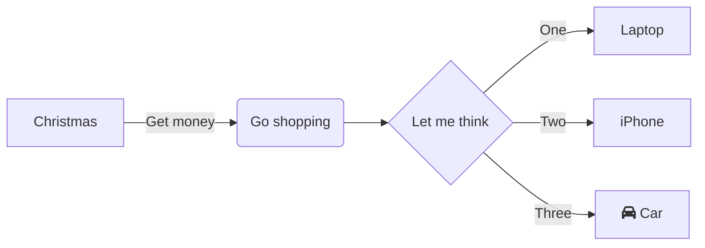

# 关于 Mermaid

**Mermaid 允许你使用文本和代码创建图表和可视化。** 

它是一个基于 JavaScript 的图表绘制工具，可渲染 Markdown 启发的文本定义以动态创建和修改图表。

```mermaid
flowchart LR
    A[Christmas] -->|Get money| B(Go shopping)
    B --> C{Let me think}
    C -->|One| D[Laptop]
    C -->|Two| E[iPhone]
    C -->|Three| F[fa:fa-car Car]
```
